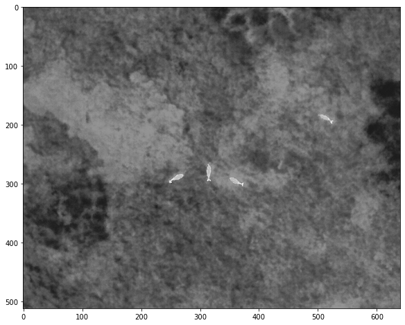
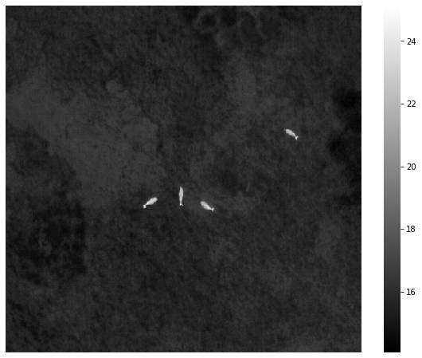
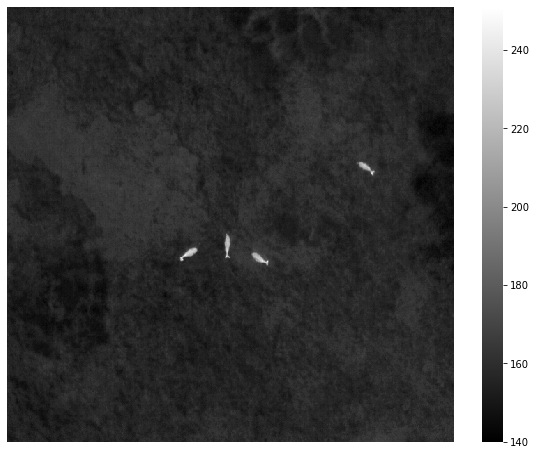

DJI Thermal SDK
================

<!-- WARNING: THIS FILE WAS AUTOGENERATED! DO NOT EDIT! -->

``` python
from dji_thermal_sdk.dji_sdk import *
from dji_thermal_sdk.utility import rjpeg_to_heatmap, rjpeg_to_thermal
import dji_thermal_sdk.dji_sdk as DJI
import ctypes as CT
from ctypes import *
import os
import matplotlib.pyplot as plt
import numpy as np
import seaborn as sns
```

This version of DJI Thermal SDK is 1.3, which was published on
05/15/2022

## Install

`pip install dji_thermal_sdk`

## The package only can work on Windows System.

Normally, DJI SDK DLLs include
`libdirp.dll, libv_dirp.dll, libv_girp.dll, libv_iirp.dll, libv_list.ini`.

DJI does not provide the library for Linux. Therefore, if you run the
package on Linux, python complier will pop out ‘invalid ELF header’
error.

Firstly, you should invoke ‘dji_init’ to initialize DJI sdk environment.
This step is very important

## Initialize the DJI environment. This step is very important

``` python
nbdev.show_doc(dji_init)
```

------------------------------------------------------------------------

### dji_init

>      dji_init (dllpath:str=None)

if you don’t provide the file path of ‘libdirp.dll’, the default
‘libdirp.dll’ with version 1.3 will be automatically chosen.

``` python
dji_init()
DJI._libdirp
```

    <CDLL 'C:\Users\hxl170008\Documents\git_repo\dji_thermal_sdk\dji_thermal_sdk\libdirp.dll', handle 7ffcdb580000>

## Get the handle of a R-JPEG image

DIRP_HANDLE is a void pointer, and it has been definded.  
you can get it by `package.DIRP_HANDLE`

``` python
nbdev.show_doc(dirp_create_from_rjpeg)
```

------------------------------------------------------------------------

### dirp_create_from_rjpeg

>      dirp_create_from_rjpeg (data, size, ph)

Parameters: \[in\] data: R-JPEG binary data buffer pointer \[in\] size:
R-JPEG binary data buffer size in bytes \[out\]ph : DIRP API handle
pointer - reminder: use two-level pointer to assign value to one-level
pointer Return: int return code dirp_ret_code_e

``` python
rd = r"dataset\Deer_Goats_Unsure.jpg"
with open(rd, 'rb') as f:
    content = f.read()
    print(len(content))
# method1 to get the file size
print(f"File size: {os.path.getsize(rd)}")
# method 2 to get the file size
file_stat = os.stat(rd)
size = c_int32(file_stat.st_size)
print(f"File size: {size}")

# the method to create a string buffer, which is important.
rjpeg_data = CT.create_string_buffer(len(content))
rjpeg_data.value = content
print(f"rjpeg_data: {rjpeg_data}")

# test the function to create a handle of an image
ret = dirp_create_from_rjpeg(rjpeg_data,size, CT.byref(DIRP_HANDLE))
print(f'ret = {ret}')
if ret == 0:
    print("successfully get the r-jpeg handle.")
#
print(f"DIRP_HANDLE: {DIRP_HANDLE}  address: {hex(DIRP_HANDLE.value)} ")
```

    1367428
    File size: 1367428
    File size: c_long(1367428)
    rjpeg_data: <ctypes.c_char_Array_1367428 object>
    ret = 0
    successfully get the r-jpeg handle.
    DIRP_HANDLE: c_void_p(2201333297840)  address: 0x20089b072b0 

## Get the version of API

``` python
nbdev.show_doc(dirp_get_api_version)
```

<h4 id="dirp_get_api_version" class="doc_header">
<code>dirp_get_api_version</code><a href="https://github.com/lyuhaitao/dji_thermal_sdk/tree/master/dji_thermal_sdk/dji_sdk.py#L193" class="source_link" style="float:right">\[source\]</a>
</h4>

> <code>dirp_get_api_version</code>(**`version`**)

Parameters: \[out\] version DIRP API version information pointer Return:
int return code dirp_ret_code_e

``` python
nbdev.show_doc(dirp_api_version_t)
```

<h2 id="dirp_api_version_t" class="doc_header">
<code>class</code>
<code>dirp_api_version_t</code><a href="https://github.com/lyuhaitao/dji_thermal_sdk/tree/master/dji_thermal_sdk/dji_sdk.py#L68" class="source_link" style="float:right">\[source\]</a>
</h2>

> <code>dirp_api_version_t</code>() :: `Structure`

API version structure definition

``` python
jpeg_version = dirp_api_version_t() 
ret = dirp_get_api_version(CT.byref(jpeg_version))
if ret == DIRP_SUCCESS:
    print("Success")
#
print(f"jpeg_version.api: \t {jpeg_version.api}")
print(f"jpeg_version.magic: \t {jpeg_version.magic}")
```

    Success
    jpeg_version.api:    19
    jpeg_version.magic:      b'b85e4d3'

## Get the version of DJI JPG

``` python
nbdev.show_doc(dirp_get_rjpeg_version)
```

------------------------------------------------------------------------

### dirp_get_rjpeg_version

>      dirp_get_rjpeg_version (h, version)

Get R-JPEG version. Parameters \[in\]h:DIRP API handle \[out\]version:
R-JPEG version information pointer Returns int return code
dirp_ret_code_e

``` python
nbdev.show_doc(dirp_rjpeg_version_t)
```

------------------------------------------------------------------------

### dirp_rjpeg_version_t

R-JPEG version structure definition

``` python
jpeg_version = dirp_rjpeg_version_t()
ret = dirp_get_api_version(CT.byref(jpeg_version))
if ret == DIRP_SUCCESS:
    print("Success")
#
print(f"rjpeg:{jpeg_version.rjpeg}")
print(f"header:{jpeg_version.header}")
print(f"curve:{jpeg_version.curve}")
```

    Success
    rjpeg:19
    header:1697986658
    curve:3367988

## Get Color Bar

``` python
nbdev.show_doc(dirp_get_color_bar)
```

<h4 id="dirp_get_color_bar" class="doc_header">
<code>dirp_get_color_bar</code><a href="https://github.com/lyuhaitao/dji_thermal_sdk/tree/master/dji_thermal_sdk/dji_sdk.py#L205" class="source_link" style="float:right">\[source\]</a>
</h4>

> <code>dirp_get_color_bar</code>(**`h`**, **`color_bar`**)

Parameters: \[in\] h: DIRP API handle \[out\] color_bar: ISP color bar
parameters pointer Return: int return code dirp_ret_code_e

``` python
nbdev.show_doc(dirp_color_bar_t)
```

<h2 id="dirp_color_bar_t" class="doc_header">
<code>class</code>
<code>dirp_color_bar_t</code><a href="https://github.com/lyuhaitao/dji_thermal_sdk/tree/master/dji_thermal_sdk/dji_sdk.py#L74" class="source_link" style="float:right">\[source\]</a>
</h2>

> <code>dirp_color_bar_t</code>() :: `Structure`

Color bar parameters structure definition

``` python
jpeg_color_bar = dirp_color_bar_t()
ret = dirp_get_color_bar(DIRP_HANDLE, CT.byref(jpeg_color_bar))
if ret == DIRP_SUCCESS:
    print("Success")
print(f"jpeg_color_bar.high: \t {jpeg_color_bar.high}")
print(f"jpeg_color_bar.low: \t {jpeg_color_bar.low}")
print(f"jpeg_color_bar.manual_enable: \t {jpeg_color_bar.manual_enable}")
```

    Success
    jpeg_color_bar.high:     -131073.015625
    jpeg_color_bar.low:      9.10844001811131e-44
    jpeg_color_bar.manual_enable:    False

## Get the resolution of a R-JPEG image

nbdev.show_doc(dirp_create_from_rjpeg)

``` python
nbdev.show_doc(dirp_get_rjpeg_resolution)
```

<h4 id="dirp_get_rjpeg_resolution" class="doc_header">
<code>dirp_get_rjpeg_resolution</code><a href="https://github.com/lyuhaitao/dji_thermal_sdk/tree/master/dji_thermal_sdk/dji_sdk.py#L336" class="source_link" style="float:right">\[source\]</a>
</h4>

> <code>dirp_get_rjpeg_resolution</code>(**`h`**, **`rjpeg_info`**)

Get R-JPEG image resolution information. Parameters \[in\]h: DIRP API
handle \[out\]rjpeg_info: R-JPEG basic information pointer Returns int
return code dirp_ret_code_e

``` python
nbdev.show_doc(dirp_resolution_t)
```

<h2 id="dirp_resolution_t" class="doc_header">
<code>class</code>
<code>dirp_resolution_t</code><a href="https://github.com/lyuhaitao/dji_thermal_sdk/tree/master/dji_thermal_sdk/dji_sdk.py#L133" class="source_link" style="float:right">\[source\]</a>
</h2>

> <code>dirp_resolution_t</code>() :: `Structure`

The image size structure definition

``` python
rjpeg_resolution = dirp_resolution_t()
ret = dirp_get_rjpeg_resolution(DIRP_HANDLE, CT.byref(rjpeg_resolution))
print(f'ret = {ret}')
if ret == 0:
    print("successfully get the resolution.")

out = f'Height: {rjpeg_resolution.height}, width: {rjpeg_resolution.width}'
out
```

    ret = 0
    successfully get the resolution.

    'Height: 512, width: 640'

## Set Pseudo Color

``` python
nbdev.show_doc(dirp_set_pseudo_color)
```

------------------------------------------------------------------------

<a
href="https://github.com/lyuhaitao/dji_thermal_sdk/blob/master/dji_thermal_sdk/dji_sdk.py#LNone"
target="_blank" style="float:right; font-size:smaller">source</a>

### dirp_set_pseudo_color

>      dirp_set_pseudo_color (h, pseudo_color)

Set custom ISP pseudo color type. Parameters \[in\]h:DIRP API handle
\[in\]pseudo_color:ISP pseudo color type dirp_pseudo_color_e Returns int
return code dirp_ret_code_e

- DIRP_PSEUDO_COLOR_WHITEHOT = 0
- DIRP_PSEUDO_COLOR_FULGURITE = 1
- DIRP_PSEUDO_COLOR_IRONRED = 2
- DIRP_PSEUDO_COLOR_HOTIRON = 3
- DIRP_PSEUDO_COLOR_MEDICAL = 4
- DIRP_PSEUDO_COLOR_ARCTIC = 5
- DIRP_PSEUDO_COLOR_RAINBOW1 = 6
- DIRP_PSEUDO_COLOR_RAINBOW2 = 7
- DIRP_PSEUDO_COLOR_TINT = 8
- DIRP_PSEUDO_COLOR_BLACKHOT = 9

``` python
ret = dirp_set_pseudo_color(DIRP_HANDLE, c_int(0))
if ret == DIRP_SUCCESS:
    print("Success")
else:
    print(f"Error: ret={ret}")
```

    Success

## Transform a thermal image by a specific palette

``` python
nbdev.show_doc(dirp_process)
```

------------------------------------------------------------------------

### dirp_process

>      dirp_process (h, color_image, size)

Run ISP algorithm with RAW data in R-JPEG and output RGB pseudo color
image. The ISP configurable parameters can be modifed by these APIs:
dirp_set_enhancement_params dirp_set_isotherm dirp_set_color_bar
dirp_set_pseudo_color Parameters \[in\]h:DIRP API handle
\[out\]color_image:Color image data buffer pointer \[in\]size:Color
image data buffer size in bytes. Returns int return code dirp_ret_code_e

``` python
size = rjpeg_resolution.height * rjpeg_resolution.width * 3 * CT.sizeof(c_uint8)
raw_image_buffer = CT.create_string_buffer(size)
print(raw_image_buffer.raw[100])
ret = dirp_process(DIRP_HANDLE,byref(raw_image_buffer), size)
if ret == DIRP_SUCCESS:
    print("Success")
else:
    print(f"Error: ret={ret}")
#
raw_file_path = os.path.splitext(rd)[0] + ".raw"
print(raw_file_path)
with open(raw_file_path, 'wb') as f:
    f.write(raw_image_buffer.raw)
#
if os.path.exists(raw_file_path):
    print(f"Success! file size: {os.path.getsize(raw_file_path)}")
else:
    print("Error")
#
with open(raw_file_path, encoding='cp1252') as fin:
    img = np.fromfile(fin, dtype = np.uint8)
    print(img.shape)
    img.shape = (512,640,3)
    #original = Image.fromarray(img)
#

fig = plt.figure(figsize=(10,8))
plt.imshow(img, cmap='gray')
```

## rjpge_to_thermal

``` python
nbdev.show_doc(rjpeg_to_thermal)
```

------------------------------------------------------------------------

### rjpeg_to_thermal

>      rjpeg_to_thermal (src:str, palette:int)

parameters: \[str\] src: file path of original jpg. For example, c:.jpg
\[int\] palette: the number of palette - DIRP_PSEUDO_COLOR_WHITEHOT =
0 - DIRP_PSEUDO_COLOR_FULGURITE = 1 - DIRP_PSEUDO_COLOR_IRONRED = 2 -
DIRP_PSEUDO_COLOR_HOTIRON = 3 - DIRP_PSEUDO_COLOR_MEDICAL = 4 -
DIRP_PSEUDO_COLOR_ARCTIC = 5 - DIRP_PSEUDO_COLOR_RAINBOW1 = 6 -
DIRP_PSEUDO_COLOR_RAINBOW2 = 7 - DIRP_PSEUDO_COLOR_TINT = 8 -
DIRP_PSEUDO_COLOR_BLACKHOT = 9 return: return numpy.ndarray -\> img

``` python
if DJI._libdirp == "":
    print("run dji_init() to initialize the DJI sdk.")
src = r"dataset\Deer_Goats_Unsure.jpg"
img = rjpeg_to_thermal(src,0)
fig = plt.figure(figsize=(10,8))
plt.imshow(img)
plt.show()
```



## rjpge_to_heatmap

``` python
nbdev.show_doc(rjpeg_to_heatmap)
```

------------------------------------------------------------------------

### rjpeg_to_heatmap

>      rjpeg_to_heatmap (src:str, dtype='float32')

parameters: \[str\] src: file path of original jpg. For example, c:.jpg
\[str\] dtype: ‘float32’ or ‘int16’ return: return numpy.ndarray -\> img

``` python
if DJI._libdirp == "":
    print("run dji_init() to initialize the DJI sdk.")
src = r"dataset\Deer_Goats_Unsure.jpg"
img = rjpeg_to_heatmap(src,dtype='float32')
fig = plt.figure(figsize=(10,8))
ax = sns.heatmap(img, cmap='gray')
ax.set_xticks([])
ax.set_yticks([])
plt.show()
```



``` python
if DJI._libdirp == "":
    print("run dji_init() to initialize the DJI sdk.")
src = r"dataset\Deer_Goats_Unsure.jpg"
img = rjpeg_to_heatmap(src,dtype='int16')
fig = plt.figure(figsize=(10,8))
ax = sns.heatmap(img, cmap='gray')
ax.set_xticks([])
ax.set_yticks([])
plt.show()
```


